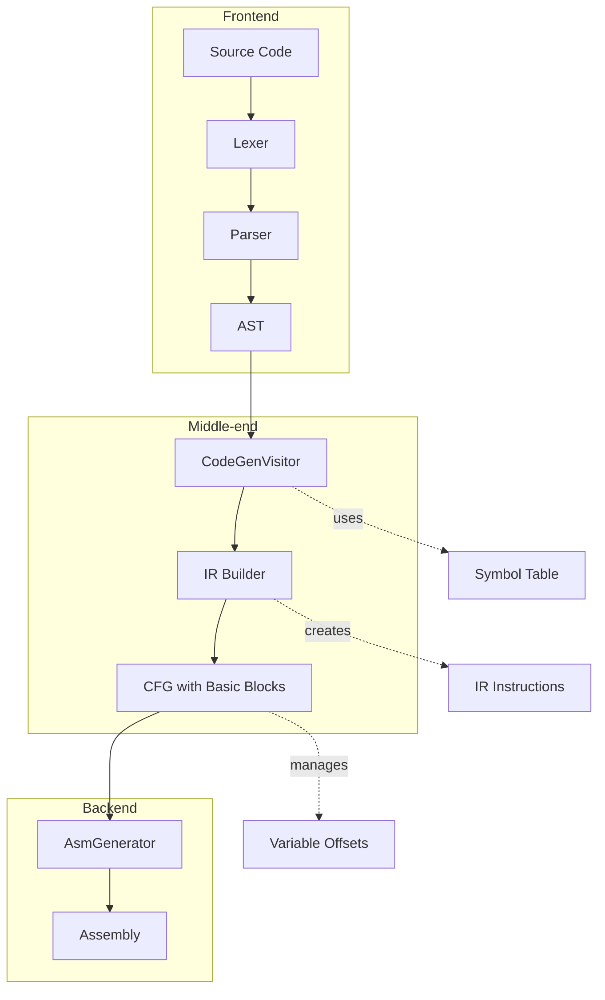

# Compiler Architecture

This document describes the internal design and components of the ifcc C compiler.

## Overview

The ifcc compiler follows a classic compiler pipeline architecture:

```
Source Code (C)
      │
      ▼
┌─────────────────┐
│  ANTLR4 Parser  │  (Lexer + Parser)
│   ifcc.g4       │  Generates AST
└────────┬────────┘
         │
         ▼
┌─────────────────┐
│ CodeGenVisitor  │  AST → IR
│ (Visitor Pattern)│ Transforms AST to 3-address IR
└────────┬────────┘
         │
         ▼
┌─────────────────┐
│      IR         │  Intermediate Representation
│  (CFG + BBs)    │  Control Flow Graph with Basic Blocks
└────────┬────────┘
         │
         ▼
┌─────────────────┐
│ AsmGenerator    │  IR → Assembly
│ x86_64 / ARM64  │  Architecture-specific code generation
└────────┬────────┘
         │
         ▼
  Assembly Output
```

## Components

### 1. ANTLR4 Grammar ([`compiler/ifcc.g4`](../compiler/ifcc.g4))

The grammar file defines the lexical rules and parsing structure for the C subset:

- **Lexer Rules**: `CONST`, `VAR`, `RETURN`, `COMMENT`, `DIRECTIVE`, `WS`
- **Parser Rules**: `prog`, `statement`, `expr`, `declaration`, `assignment`, etc.

The grammar uses ANTLR4's visitor pattern to generate:
- `ifccLexer.cpp/h` — Tokenizes input
- `ifccParser.cpp/h` — Builds parse tree
- `ifccVisitor.cpp/h` — Base visitor interface

### 2. CodeGenVisitor ([`compiler/src/CodeGenVisitor.h`](../compiler/src/CodeGenVisitor.h))

The main visitor class that traverses the AST and generates Intermediate Representation (IR).

**Key responsibilities:**
- Visits parse tree nodes
- Creates IR instructions for each language construct
- Manages symbol table (variable names, types, offsets)
- Handles control flow (if/while/for)

**Sub-visitors** (in [`compiler/src/visitors/`](../compiler/src/visitors/)):
- `CodeGenArithmetic` — +, -, *, /, %
- `CodeGenBitwise` — &, ^, ~
- `CodeGenComparison` — ==, !=
- `CodeGenMemory` — Variable access
- `CodeGenFunction` — Function calls and definitions

### 3. Intermediate Representation ([`compiler/src/IR.h`](../compiler/src/ir/IR.h))

The IR uses a **Control Flow Graph (CFG)** with **Basic Blocks** and **3-address instructions**.

#### CFG (Control Flow Graph)
Represents a function with:
- Multiple basic blocks
- Entry and exit blocks
- Symbol table for variables
- Function signatures

#### BasicBlock
A sequence of instructions with:
- No jumps (except at end)
- Single entry, single exit
- Contains IR instructions
- Manages its own symbol table slice

#### IRInstr (3-address instructions)
| Operation | Description | Parameters |
|-----------|-------------|------------|
| `ldconst` | Load constant | `d, c` |
| `copy` | Copy value | `d, s` |
| `add` | Addition | `d, x, y` |
| `sub` | Subtraction | `d, x, y` |
| `mul` | Multiplication | `d, x, y` |
| `div` | Division | `d, x, y` |
| `bit_and` | Bitwise AND | `d, x, y` |
| `bit_or` | Bitwise OR | `d, x, y` |
| `bit_xor` | Bitwise XOR | `d, x, y` |
| `cmp_eq` | Compare equal | `d, x, y` |
| `cmp_lt` | Compare less | `d, x, y` |
| `cmp_le` | Compare less or equal | `d, x, y` |
| `rmem` | Read memory | `d, addr` |
| `wmem` | Write memory | `addr, s` |
| `call` | Function call | `label, d, params` |
| `ret` | Return value | `v` |

### 4. Assembly Generators

#### AsmGenerator Base Class ([`compiler/src/asm/AsmGenerator.h`](../compiler/src/asm/AsmGenerator.h))

Abstract interface defining the contract for architecture-specific code generation.

#### x86_64 Generator ([`compiler/src/asm/x86_64/AsmGeneratorX86_64.h`](../compiler/src/asm/x86_64/AsmGeneratorX86_64.h))

Generates x86-64 (64-bit Intel/AMD) assembly using:
- System V AMD64 ABI
- Registers: rax, rbx, rcx, rdx, rsi, rdi, rbp, rsp
- Stack-allocated local variables

#### ARM64 Generator ([`compiler/src/asm/arm64/AsmGeneratorARM64.h`](../compiler/src/asm/arm64/AsmGeneratorARM64.h))

Generates ARM64 (Apple Silicon) assembly using:
- AAPCS64 ABI
- Registers: x0-x30, sp
- Stack-allocated local variables

## Data Flow



## Symbol Table

The symbol table is managed at two levels:

1. **BasicBlock Level**: Maps variable names to stack offsets
2. **CFG Level**: Manages function signatures and global scope

Variables are allocated on the stack with negative offsets from `rbp` (x86) or `fp` (ARM).

## Build System

The build uses Make with configuration files:

| File | Description |
|------|-------------|
| `config.mk` | Main configuration (copy from template) |
| `config-wsl-2025.mk` | WSL/Linux template |
| `config-macos.mk` | macOS template |
| `config-IF501.mk` | INSA lab machines |

Key configuration variables:
- `ANTLRJAR` — Path to ANTLR4 JAR
- `ANTLRINC` — Path to ANTLR4 C++ headers
- `ANTLRLIB` — Path to ANTLR4 C++ library
